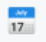
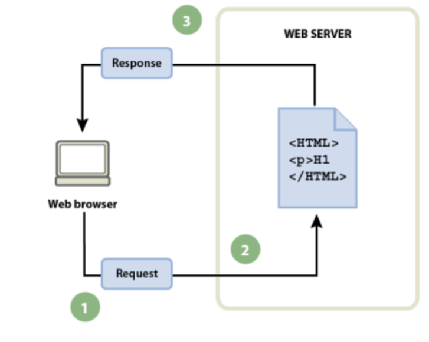

# ASIX_UF1_A2_ Evaluación inicial
1. ¿Qué es una pagina web?

    Es un documento digital complejo, que puede integrar y/o contener texto, sonido, vídeo, programas, enlaces, imágenes, hipervínculos y otros elementos. Además puede ser accedida y visualizada mediante un navegador web.
2. ¿Qué es un sitio web?

    Es un espacio virtual que contiene toda la información que una persona o empresa quiere difundir a través de internet.
3. ¿Qué es una aplicación web?

    Es un software cliente-servidor que permite realizar funciones determinadas en internet, como enviar mensajes, realizar compras, editar imágenes...
4. ¿Qué es una herramienta ofimática?

    Son aquellos programas o aplicaciones que nos permiten manipular informáticamente la información con la que se trabaja de forma habitual en una oficina.
5. [Herramientas de Google](https://www.google.com/intl/es-419/chrome/browser-tools/ "Herramientas de Google")

|Aplicaciones| Visto|
|-------------|:---------:|
|Google Docs ||
|Google Slides ||
|Google Sheets ||
|Google Calendar ||
|Google Meet ||
|... | |...|

6. ¿Qué es HTML?
    Es el código que se utiliza para estructurar y desplegar una página web y sus contenidos.
    
```
<!DOCTYPE html>
<html lang="en">
<head>
    <meta charset="UTF-8">
    <META HTTP-EQUIV="X-UA-Compatible" content="ie=edge">
    <meta name="viewport" content="width=device-width initial-scale=1.0">
    <title>Document</title>
    </head>
    <body>

    </body>
    </html>
```

7. ¿Qué es CSS?
    
    Ordenar las instrucciones referentes a la apariencia de un sitio y presentar los contenidos de una página de forma atractiva.

8. Flujo de trabajo (navegador, petición, servidor y respuesta):
 
